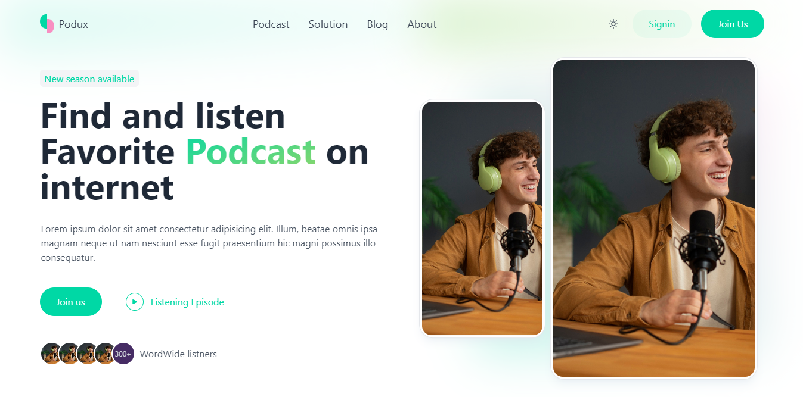
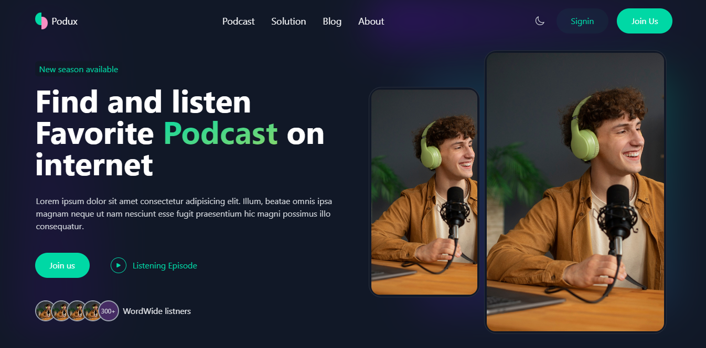
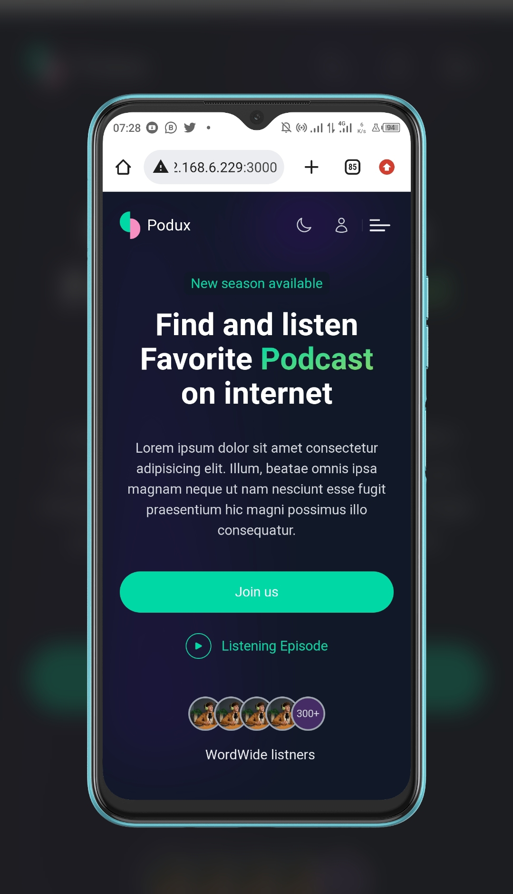

# Podux

Podcast website landing page






## Tools

-   TailwindCSS 3
-   NUXT 3

Look at the [Nuxt 3 documentation](https://nuxt.com/docs/getting-started/introduction) to learn more.

## Setup
Make sure to install the dependencies:

```bash
# npm
npm install
```

## Development Server

Start the development server on http://localhost:3000

```bash
npm run dev
```

## Production

Build the application for production:

```bash
npm run build
```

Locally preview production build:

```bash
npm run preview
```
